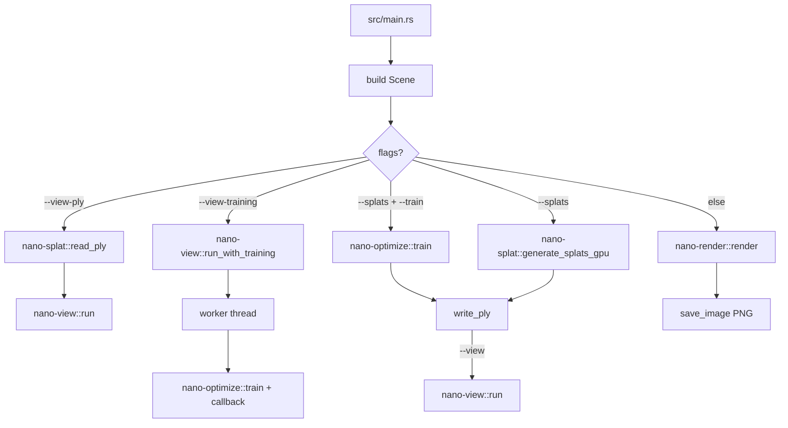
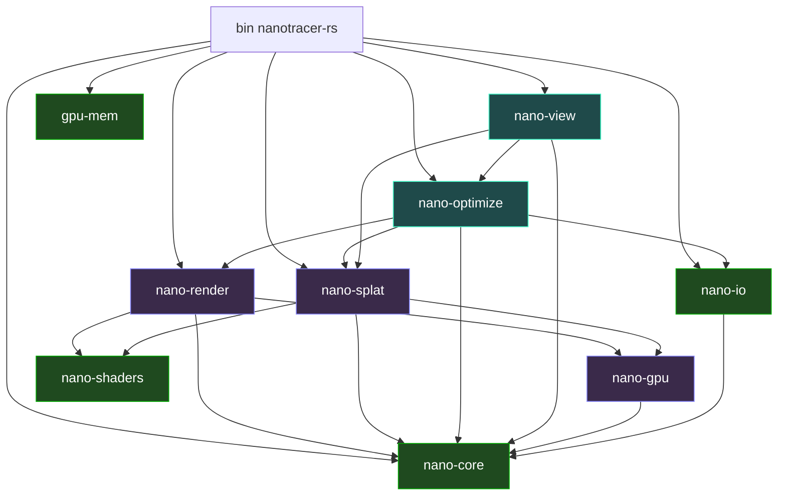
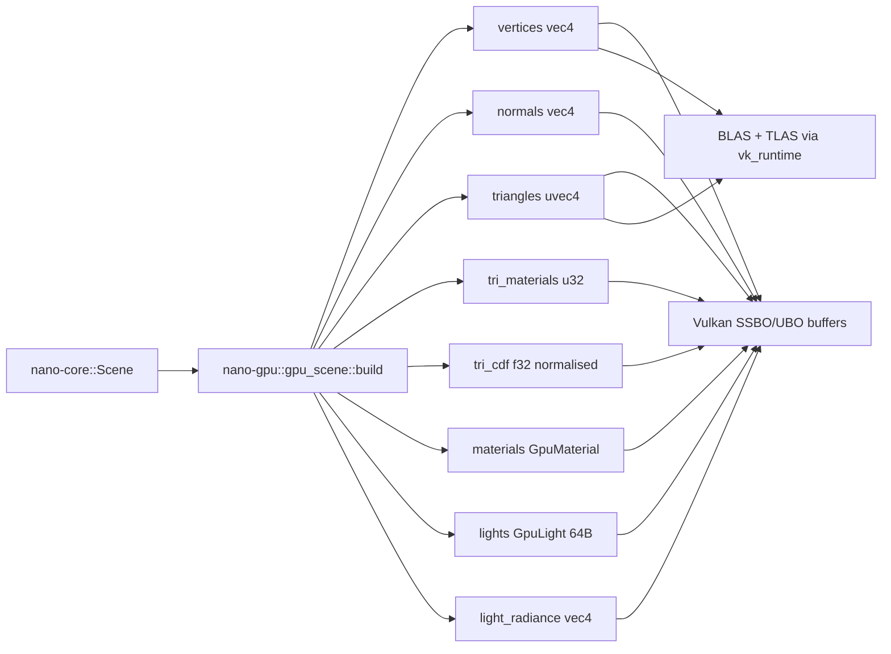
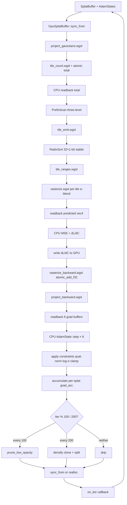
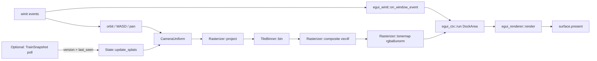
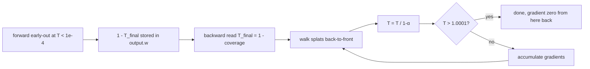

# DIAGRAMS.md — mermaid flow diagrams

Companion to `AGENTS.md`. Mermaid versions of every diagram for
GitHub / IDE rendering. Full prose in the mdbook (`docs/src/`).

---

## 1. CLI dispatch



## 2. Crate dependency graph



Pure (green) = no GPU runtime. ash (purple) = needs Vulkan + ray
queries. wgpu (teal) = portable compute / surface.

## 3. Scene → GPU buffers



## 4. Training pipeline (one iteration)



## 5. Viewer per-frame loop



## 6. Light enum dispatch

```mermaid
flowchart TD
    Light --> kind{kind}
    kind -->|Point|  P[L_e &middot; cos_x]
    kind -->|Rect|   R[L_e &middot; cos_x &middot; cos_y &middot; A / r²]
    kind -->|Box|    B[same as Rect over 6 faces]
    kind -->|Sphere| S[solid-angle MC, area fallback inside]
    kind -->|Env|    E[eval_env_irradiance N &middot; intensity]
    P & R & B & S --> shadow[shadow_ray]
    E -.skip shadow.-> diffuse
    shadow --> diffuse[diffuse_radiance + specular_radiance]
```

## 7. Backward T-reconstruction (with stability clamp)



## 8. Quick reference — which crate owns what

| Concern | Crate | Key types / fns |
|---|---|---|
| Scene + geometry | `nano-core` | `Scene`, `Object`, `Geometry`, `Mesh`, `Light`, `EnvironmentMap` |
| Materials | `nano-core::material` | `Material`, `IVORY`, `GLASS`, `MIRROR`, `MATTE_*` |
| Colour pipeline | `nano-core::color` | `tonemap_reinhard`, `linear_to_srgb` |
| CPU SH reference | `nano-core::sh` | `sh_basis`, `fit_sh`, `eval_sh` |
| Light enum | `nano-core::scene::Light` | `Point`/`Rect`/`Sphere`/`Box`/`Env` |
| glTF / PNG | `nano-io` | `load_glb_mesh`, `save_image` |
| GLSL chunks | `nano-shaders` | `PREAMBLE`, `HELPERS`, `sample_light`, `assemble` |
| Vulkan runtime | `nano-gpu::vk_runtime` | `VkContext` |
| Scene → GPU | `nano-gpu::gpu_scene` | `build_gpu_scene*`, `GpuLight` 64B |
| Image renderer | `nano-render` | `render`, `RenderConfig` |
| Forward-fit splat | `nano-splat::generator` | `generate_splats_gpu`, `SplatConfigGpu` |
| Splat PLY r/w | `nano-splat::ply` | `read_ply`, `write_ply`, `Gaussian` |
| wgpu context | `nano-optimize::gpu` | `WgpuCtx` |
| GPU splat buffer | `nano-optimize::splat_gpu` | `GpuSplatBuffer`, `GradSplatBuffers` |
| Rasteriser passes | `nano-optimize::raster` | `Rasterizer` (project/composite/backward/tonemap), `ProjectedSplat`, `ProjectedGrad` |
| Tile binning | `nano-optimize::tile_binner` | `TileBinner`, `TilingParams` |
| Scan / sort | `nano-optimize::{prefix_scan, radix_sort}` | `PrefixScan`, `RadixSort` |
| Adam optimiser | `nano-optimize::adam` | `AdamState`, `AdamConfig` |
| Training loop | `nano-optimize::train` | `train(scene, cfg, on_iter)`, `TrainConfig` |
| Reference baking | `nano-optimize::reference` | `bake_references`, `ReferenceView`, `BakeConfig` |
| Viewer | `nano-view` | `run`, `run_with_training`, `TrainStats` |
| VRAM probe | `gpu-mem` | `query`, `sys_mem` |

---

Full prose: see `docs/src/` (mdbook). Decision log: `docs/src/decisions.md`.
Roadmap: `docs/src/roadmap.md`.
