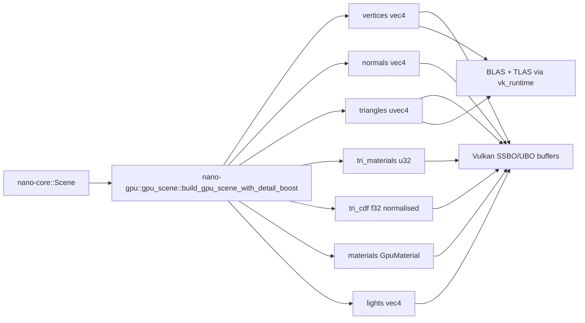
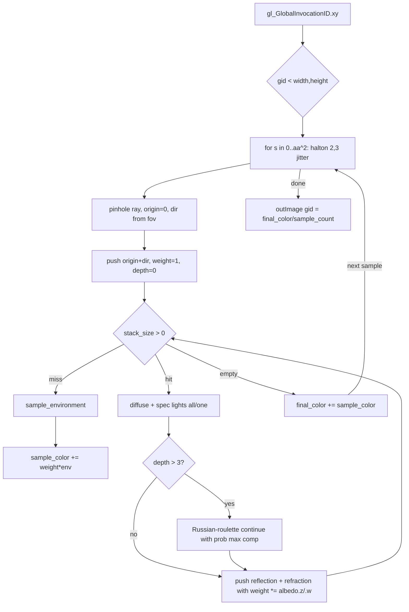
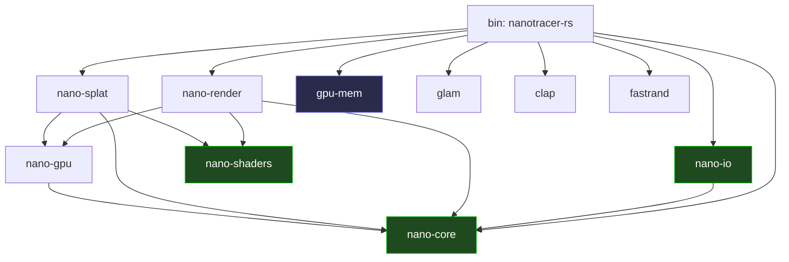
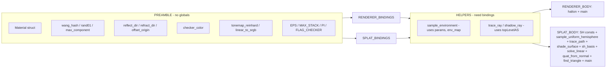

# DIAGRAMS.md — nanotracer-rs flow diagrams (mermaid)

Companion to `AGENTS.md`. Same diagrams in mermaid for GitHub / IDE
rendering. Updated for the 2026-05 7-crate workspace layout.

---

## 1. Top-level CLI dispatch

```mermaid
flowchart TD
    A[src/main.rs] -->|gpu_mem::query startup| B[print GPU info]
    A -->|build Scene| S[nano-core::Scene]
    S --> SPL{--splats FILE?}
    SPL -->|yes| RTS[nano-splat::generate_splats_gpu]
    SPL -->|no|  RTR[nano-render::render]
    RTS --> PLY[nano-splat::ply::write_ply]
    RTR --> PNG[nano-io::utils::save_image]
    PLY --> OUT1[(scene.ply)]
    PNG --> OUT2[(output.png)]
```

## 2. Scene → GPU buffers



## 3. Splat generation pipeline (shader-level)

```mermaid
flowchart TD
    ID[gl_GlobalInvocationID.x] --> CDF_PICK[find_triangle on tri_cdf]
    CDF_PICK --> BARY[uniform barycentric sqrt-r1 / r2]
    BARY --> FETCH[interpolate pos, normal, fetch material]
    FETCH --> FRAME[build tangent frame]
    FRAME --> LOOP{for s in 0..&lpar;sh_samples + glossy_extra&rpar;}
    LOOP --> DIR[hemisphere sampler &mdash; idx stratified + golden ratio]
    DIR --> SHADE[shade_surface: all lights + reflect/refract trace_path]
    SHADE --> CLAMP[luma clamp]
    CLAMP --> TM[tonemap reinhard?]
    TM --> SRGB[linear_to_srgb]
    SRGB --> ACC[accumulate ATA, ATB for 16 SH basis funcs]
    ACC --> LOOP
    LOOP -->|done| TIK[band-aware Tikhonov &lambda;_l]
    TIK --> SOLVE[solve_linear x3 R/G/B]
    SOLVE --> DC[sh_dc = coeffs_0 - F1]
    DC --> GLOSSY{albedo.z &gt; 0 OR albedo.w &gt; 0}
    GLOSSY -->|yes| ZERO[zero coeffs 1..15 - F4]
    GLOSSY -->|no|  KEEP[keep full SH]
    ZERO --> PACK
    KEEP --> PACK
    PACK[pack GaussianOut: pos, normal, sh_dc, sh_rest planar, opacity logit, scale log F5, rot quat-from-normal] --> WRITE[gaussians ID]
```

## 4. Image renderer pipeline (shader-level)



## 5. Crate dependency graph



`nano-shaders` is pure GLSL string constants (no runtime deps); `gpu-mem`
is `std`-only vendored from `vfx-rs`.

## 6. Shared GLSL split



## 7. Quick reference: which crate owns what

| Concern | Crate | Key types / fns |
|---|---|---|
| Scene & geometry data | `nano-core` | `Scene`, `Object`, `Geometry`, `Mesh`, `Light` |
| Materials | `nano-core::material` | `Material`, `IVORY`, `GLASS`, `MIRROR`, `MATTE_*` |
| Environment IBL | `nano-core::environment` | `EnvironmentMap`, `EnvGpuData` |
| Colour pipeline | `nano-core::color` | `tonemap_reinhard`, `linear_to_srgb`, `apply_tonemap_srgb` |
| CPU SH reference | `nano-core::sh` | `sh_basis`, `fit_sh`, `eval_sh`, `fibonacci_hemisphere` |
| Light-sampling enum | `nano-core::LightSampling` | `All`, `One`, `.as_u32()` |
| glTF mesh loader | `nano-io::gltf_loader` | `load_glb_mesh` |
| PNG framebuffer writer | `nano-io::utils` | `save_image` |
| GLSL chunks | `nano-shaders` | `PREAMBLE`, `HELPERS`, `assemble` |
| Vulkan runtime | `nano-gpu::vk_runtime` | `VkContext`, `AccelResource`, `BufferResource`, `ImageResource` |
| Scene → GPU marshalling | `nano-gpu::gpu_scene` | `build_gpu_scene*`, `GpuMaterial`, `GpuTriangle` |
| Image renderer | `nano-render` | `render`, `RenderConfig` |
| Splat generator | `nano-splat::generator` | `generate_splats_gpu`, `SplatConfigGpu` |
| Splat PLY writer | `nano-splat::ply` | `write_ply`, `Gaussian` |
| VRAM / RAM probe | `gpu-mem` | `query`, `sys_mem`, `GpuMemInfo`, `SysMemInfo` |

---

See `AGENTS.md` for ASCII versions and the decision log, `plan1.md` for
the bug-hunt history.
