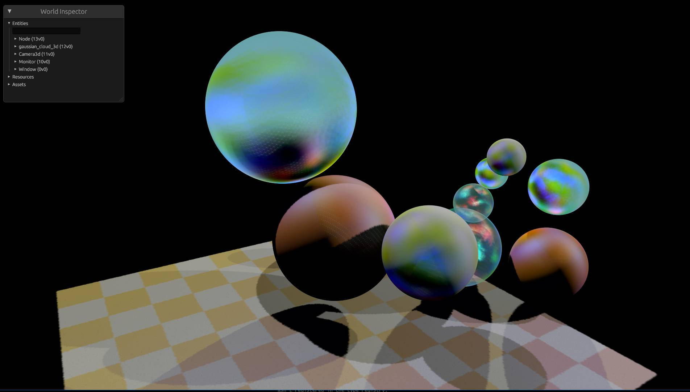

# NanoTracer-RS

High-performance path tracer in Rust with **GPU ray queries (Vulkan)**.

Based on [tinyraytracer](https://github.com/ssloy/tinyraytracer) by Dmitry V. Sokolov.



## Features

- **GPU ray tracing** via Vulkan ray queries (hardware BVH)
- **Path tracing** with reflection, refraction, soft shadows
- **Mesh primitives** (cube, pyramid, torus) with BVH acceleration on GPU
- **HDR environment maps** (.exr) or procedural sky
- **Anti-aliasing** with Halton quasi-Monte Carlo sampling

## Quick Start

```bash
cargo build --release

# Basic render
cargo run --release

# High quality with 4x AA and procedural sky
cargo run --release -- -a 4 --sky

# HDR environment lighting
cargo run --release -- -e data/studio.exr -x 0.15

# With mesh primitives
cargo run --release -- --mesh all -a 4
```

## CLI Options

| Option | Description |
|--------|-------------|
| `-a, --aa N` | Anti-aliasing samples NxN (default: 2) |
| `-m, --max N` | Max ray depth (default: 32) |
| `-r, --refl N` | Max reflection bounces (default: 6) |
| `-f, --refr N` | Max refraction bounces (default: 16) |
| `-n, --num N` | Number of random spheres (default: 200) |
| `-e, --env FILE` | HDR environment map (.exr) |
| `-x, --exposure F` | HDR exposure (default: 0.1) |
| `--sky` | Procedural sky gradient |
| `--mesh TYPE` | Add mesh: cube, pyramid, torus, all |
| `--glb FILE` | Load glTF/GLB mesh and add to scene |
| `--glb-scale F` | Scale applied to GLB mesh (default: 1.0) |
| `--no-floor` | Disable checkerboard plane |
| `--no-spheres` | Mesh-only mode |
| `-t, --tonemap` | Apply Reinhard tonemapping |
| `-S, --splats FILE` | Export Gaussian splats to PLY |
| `--sh-samples N` | SH sample directions per splat (default: 64) |
| `--sh-glossy-mult F` | SH sample multiplier for glossy/refractive materials (default: 1.5) |
| `--radiance-clamp F` | Clamp radiance before tonemapping (0 disables, default: 20) |
| `--light-sampling MODE` | Light sampling: `all` or `one` (default: one) |
| `--detail-boost F` | Adaptive density boost factor (default: 1.5, 0 disables) |
| `--detail-boost-max F` | Max adaptive boost (default: 3.0) |
| `--splat-density F` | Surface samples per unit area (default: 100) |
| `--splat-scale F` | Override splat scale (auto from density if unset) |

## Materials

| Material | Properties |
|----------|------------|
| Ivory | Diffuse with weak reflection |
| Glass | Transparent, refractive index 1.333 |
| Mirror | Highly reflective metallic |
| Red Rubber | Matte, no transparency |

## Architecture

```
src/
|-- main.rs          # CLI, scene setup
|-- rt_renderer.rs   # Vulkan ray query renderer
|-- gpu_scene.rs     # GPU scene packing
|-- scene.rs         # Scene graph
|-- geometry.rs      # Sphere, Object
|-- mesh.rs          # Triangle meshes
|-- material.rs      # Material definitions
|-- environment.rs   # HDR/procedural sky
|-- color.rs         # Tonemapping, sRGB conversion
|-- utils.rs         # PNG output
```

## Dependencies

- **glam** - vector math
- **ash** - Vulkan bindings
- **shaderc** - GLSL to SPIR-V compilation
- **image** - PNG output
- **exr** - HDR environment loading
- **clap** - CLI parsing

## Performance

- Requires a Vulkan-capable GPU with `VK_KHR_ray_query`
- Hardware BVH acceleration via Vulkan ray queries

## License

MIT
