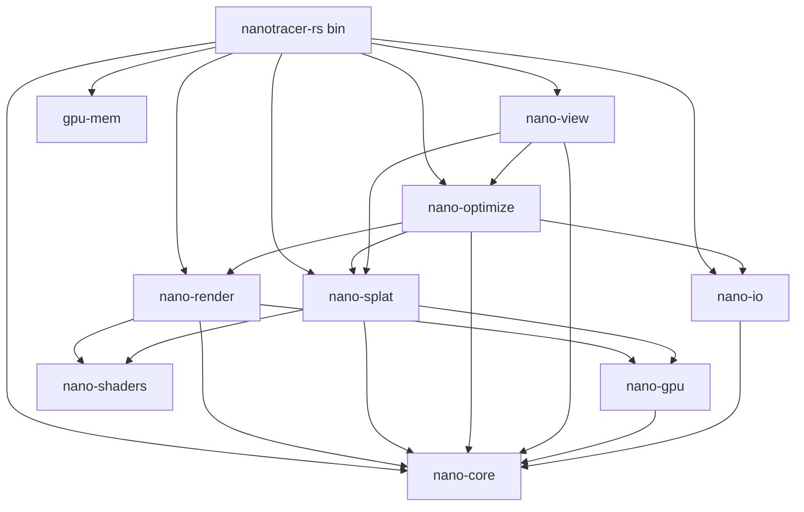

# Workspace layout

Nine crates plus a binary at the workspace root. Boundaries are
enforced by dependency edges (`Cargo.toml`); the rules below describe
what each crate is *allowed* to know.

```
nanotracer-rs/
├─ Cargo.toml          (workspace + bin)
├─ src/main.rs         (CLI dispatch only)
└─ crates/
   ├─ gpu-mem/         std-only VRAM / RAM probe
   ├─ nano-core/       CPU data types (no GPU, no I/O)
   ├─ nano-io/         glTF / PNG (no GPU)
   ├─ nano-shaders/    GLSL string chunks (no runtime deps)
   ├─ nano-gpu/        ash + shaderc; scene → GPU buffer marshalling
   ├─ nano-render/     ash compute renderer (ray-query)
   ├─ nano-splat/      forward-fit + binary 3DGS PLY r/w
   ├─ nano-optimize/   wgpu differentiable rasteriser + Adam + densify
   └─ nano-view/       winit + wgpu surface + egui_dock viewer
```

## Crate responsibilities

| Crate | Owns | Knows about |
|-------|------|-------------|
| `gpu-mem` | Cross-platform VRAM / system-RAM probe. | `std` only. |
| `nano-core` | `Scene`, `Object`, `Geometry`, `Mesh`, `Material`, `Light` enum, `EnvironmentMap`, CPU SH reference, `LightSampling` knob. | `glam`, `exr`, `bytemuck`. |
| `nano-io` | glTF/GLB loader, PNG framebuffer writer. | `nano-core`, `glam`, `image`, `gltf`. |
| `nano-shaders` | GLSL chunks (`PREAMBLE`, `HELPERS`) shared by raytrace + splat shaders. `assemble()`. `GpuLight` + `sample_light` definitions live here. | Nothing — `&'static str` constants only. |
| `nano-gpu` | `VkContext` (ash), buffer / image / AS helpers, `gpu_scene::build_*` Scene → GPU SSBO marshalling, `GpuLight` 64-byte Pod. | `nano-core`, `ash`, `shaderc`, `bytemuck`. |
| `nano-render` | Raytrace renderer compute pipeline + GLSL body. `RenderConfig`. Uses `nano-shaders` to assemble. | `nano-core`, `nano-gpu`, `nano-shaders`. |
| `nano-splat` | Forward-fit splat generator (compute pipeline + LSQ SH fit), `Gaussian` Pod + binary 3DGS PLY read/write. | `nano-core`, `nano-gpu`, `nano-shaders`. |
| `nano-optimize` | wgpu context, `GpuSplatBuffer`, `Rasterizer` (project + composite + tonemap + backward), `TileBinner`, `PrefixScan`, `RadixSort`, `AdamState`, `train()` loop. | `nano-core`, `nano-io`, `nano-render`, `nano-splat`, `wgpu`, `pollster`. |
| `nano-view` | winit `ApplicationHandler` + `wgpu::Surface` + `egui_dock` viewer, orbit camera, training-preview worker. | `nano-core`, `nano-optimize`, `nano-splat`, `egui*`, `winit`, `wgpu`. |

## Dependency graph



## Cross-crate types

A few types cross crate boundaries by design:

- `nano_core::scene::Light` — CPU enum. Marshalled into
  `nano_gpu::gpu_scene::GpuLight` (64 B std430) + a parallel
  `light_radiance` SSBO.
- `nano_splat::ply::Gaussian` — the disk-format Pod. Converted to
  `nano_optimize::SplatBuffer` (parallel `Vec`s per attribute) for
  training, then to `nano_optimize::GpuSplatBuffer` (6 SSBOs) for
  the GPU.
- `nano_optimize::ProjectedSplat` / `ProjectedGrad` — 48-byte Pods
  consumed by `tile_binner` and the backward passes; shared between
  `nano-optimize` and `nano-view` (the viewer projects splats every
  frame).

## Runtime split: `ash` vs `wgpu`

- **`ash` side** (`nano-gpu`, `nano-render`, `nano-splat`) needs
  `VK_KHR_ray_query` for hardware-accelerated traversal. `wgpu`
  exposes ray queries only behind an experimental feature flag; the
  reference baking would lose ~10× throughput on a software BVH
  fallback. See `WGPU_RESEARCH.md` for the full evaluation.
- **`wgpu` side** (`nano-optimize`, `nano-view`) is portable: the
  differentiable rasteriser, training loop, and viewer all target
  any wgpu-supported surface (Vulkan / DX12 / Metal / WebGPU).

The two GPU contexts are independent. `nano-optimize` creates its own
`WgpuCtx`; `nano-render` / `nano-splat` create their own `VkContext`.
Data passes between them as plain CPU types (`SplatBuffer`,
`Vec<Vec3>` for predicted frames).

## Where shaders live

| Where | What |
|-------|------|
| `nano-shaders/src/lib.rs` | GLSL `PREAMBLE` + `HELPERS` strings shared by raytrace shaders. `GpuLight`, `sample_light` definitions. |
| `nano-render/src/renderer.rs` (inline) | Per-shader bindings + body for the image-renderer compute shader. |
| `nano-splat/src/generator.rs` (inline) | Per-shader bindings + body for the forward-fit splat compute shader. |
| `nano-optimize/src/shaders/*.wgsl` | All WGSL files: `project_gaussians`, `scan_block`, `scan_add_offsets`, `bit_predicate`, `bit_total_zeros`, `bit_scatter`, `tile_count`, `tile_emit`, `tile_ranges`, `rasterize`, `rasterize_backward`, `project_backward`, `tonemap`. |
