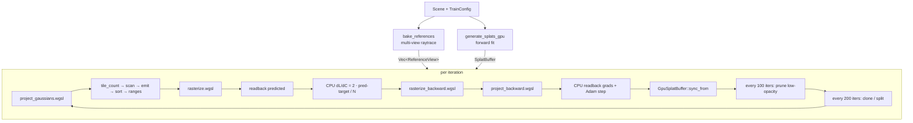

# Training pipeline — overview

`nano_optimize::train(scene, cfg, callback)` runs the full 3DGS
optimisation loop. The function is one ~250-line body; this chapter
sketches the dataflow, the others drill into the individual passes.

## Pipeline at a glance



## Setup phase (once, before the loop)

1. **Bake references** (`reference.rs::bake_references`). Walks a
   Fibonacci-sphere of cameras around the scene, calls the raytrace
   renderer (`nano-render::render`) per pose, stores
   `Vec<ReferenceView>` (each carries pixels + view matrix +
   intrinsics). This is the slow step — ~50–200 ms per view depending
   on AA. Kept on `ash` because the reference quality needs hardware
   ray queries.
2. **Seed splats** (`nano-splat::generate_splats_gpu`). Same forward
   fit that produces standalone PLYs. Output `Vec<Gaussian>` is
   wrapped into `SplatBuffer` (parallel `Vec`s per attribute,
   densify-friendly).
3. **Allocate Adam state** (`AdamState::new`) per attribute. Slabs
   sized `n_splats · stride_per_attr`. Densify grows / shrinks each
   slab in lock-step with `SplatBuffer`.
4. **Initialise wgpu** (`WgpuCtx::new`). Requests adapter limits
   (default 8 storage buffers per stage is too low — `project_backward`
   binds 13).
5. **Upload** to GPU: `GpuSplatBuffer::upload(&ctx, &splats)` creates
   the 6 SSBOs.
6. **Build pipelines**: `Rasterizer::new`, `TileBinner::new`. Each
   pipeline compiles its WGSL once and reuses across all iterations.
7. **Allocate render targets**: `projected` (per-splat 2D state),
   `predicted` (vec4 framebuffer), `projected_grad`,
   `GradSplatBuffers`, `dl_dc_buf`. All sized once at setup; the
   only reallocation happens when densify changes splat count.

## Iteration body

For each iter `i ∈ [0, cfg.iterations)`:

```rust
let view = &refs[i as usize % refs.len()];      // cycle through views
let camera = CameraUniform::from_pose(view, gpu_splats.n);

// Forward
rasterizer.project(&ctx, &gpu_splats, &camera, &projected);
let bins = binner.bin(&ctx, &projected, gpu_splats.n, &tiling);
rasterizer.composite(&ctx, &projected, &bins.sorted_payloads,
                     &bins.tile_ranges, &predicted, &tiling);

// Loss
let pred: Vec<[f32;4]> = ctx.readback(&predicted, w*h);
let mse = mean_squared_error(&pred_rgb, &view.pixels);
let dl_dc: Vec<[f32;4]> = pred.iter().zip(view.pixels)
    .map(|(p,t)| { let d = (p - t) * 2.0/(3.0*w*h as f32);
                   [d.x, d.y, d.z, 0.0] })
    .collect();
ctx.queue.write_buffer(&dl_dc_buf, 0, &dl_dc);

// Backward
rasterizer.zero_projected_grad(&ctx, &projected_grad, gpu_splats.n);
grads.zero(&ctx);
rasterizer.composite_backward(&ctx, &projected, /* ... */ &predicted,
                              &dl_dc_buf, &projected_grad, &tiling);
rasterizer.project_backward(&ctx, &gpu_splats, &projected_grad, &camera, &grads);

// Adam (CPU)
let g_pos = ctx.readback(&grads.d_positions, n);
/* ... readback rest ... */
/* flatten + AdamState::step per attribute ... */
/* write back to SplatBuffer with quat re-norm, log-σ clamp, opacity-logit clamp */

// Callback for live preview
on_iter(i, &splats, mse);

// Maintenance
if i % PRUNE_EVERY == 0 && i >= PRUNE_WARMUP {
    prune_low_opacity(&mut splats, /* + Adam states + grad_acc */);
}
if i % DENSIFY_EVERY == 0 && i >= DENSIFY_WARMUP {
    densify(&mut splats, &grad_acc, /* ... */);
}

// Sync GPU to CPU (or full realloc if count changed)
if splats.len() as u32 != gpu_splats.n {
    gpu_splats = GpuSplatBuffer::upload(&ctx, &splats);
    /* reallocate projected, projected_grad, grads to match new size */
} else {
    gpu_splats.sync_from(&ctx, &splats);
}
```

## Where the cost lives

For a 5k-splat scene at 128×96 reference views:

| Pass | Cost / iter |
|------|-------------|
| `project_gaussians`     | ~0.2 ms |
| `tile_count` + scan + emit + radix sort + ranges | ~2–5 ms (the radix sort dominates with 32 1-bit passes) |
| `rasterize` (forward)   | ~1–3 ms |
| Readback (predicted)    | ~1–2 ms (GPU↔CPU sync) |
| CPU `dL/dC`             | ~0.5 ms |
| `rasterize_backward`    | ~3–5 ms (atomic-add-f32 CAS is the slow part) |
| `project_backward`      | ~0.5 ms |
| Readback (grads)        | ~2 ms |
| CPU Adam step           | ~0.5 ms |
| `sync_from`             | ~0.5 ms |

Total ~10–20 ms / iter on a discrete GPU. 30k iters take ~5–10 min,
which is the design target.

## Stability invariants

- **Adam-state slab lengths** must always match
  `n · stride_per_attr`. `prune` and `densify` both `swap_remove` /
  `grow` every slab in lock-step.
- **Quaternions** are re-normalised after each Adam step. Otherwise
  Adam drifts off the unit hyper-sphere within ~100 iters.
- **`log_σ`** is clamped to `[-10, 5]` (σ ∈ [4.5e-5, 148]). Without
  this, narrow splats trip the `det(Σ_2D) ≤ 0` cull in the projection
  pass.
- **`opacity_logit`** is clamped to `[-10, 10]` (sigmoid ≈
  [4.5e-5, 0.9999]). Without this, the prune threshold drifts and
  splats Adam wants to "kill" never actually die.
- **Backward T-reconstruction** must bail when `T > 1.0001` — see
  [Backward](./training-backward.md) for the why.

## Callback contract

The third argument to `train` is `FnMut(u32, &SplatBuffer, f32)`:

- `u32` — iteration index.
- `&SplatBuffer` — splats *after* Adam + maintenance for this iter.
- `f32` — MSE for this iter (against the chosen reference view).

The headless training path passes `|_, _, _| {}`. The live-preview
viewer passes a closure that writes a snapshot into
`Arc<RwLock<Option<TrainSnapshot>>>` for the viewer thread to poll.
The callback runs on the training thread, not the viewer thread —
keep it cheap or you stall the loop.
