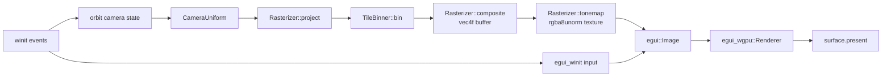

# Viewer architecture

`nano-view` is winit 0.30 + `wgpu::Surface` + `egui_dock` 0.19 with
the differentiable rasteriser from `nano-optimize` reused verbatim.
No new shaders for the rendering path beyond `tonemap.wgsl`; egui
handles the UI and final compositing.

## Per-frame pipeline



## State struct

```rust
struct State {
    ctx: WgpuCtx,                       // wgpu device + queue
    surface: wgpu::Surface<'static>,
    surface_format: wgpu::TextureFormat,
    size: PhysicalSize<u32>,

    rasterizer: Rasterizer,             // reused from nano-optimize
    binner: TileBinner,
    gpu_splats: GpuSplatBuffer,

    image_w: u32, image_h: u32,
    projected: wgpu::Buffer,            // per-splat 2D state
    composite_buf: wgpu::Buffer,        // vec4f composite output
    splat_tex: wgpu::Texture,           // rgba8unorm sampled by egui
    splat_view: wgpu::TextureView,

    egui_ctx: egui::Context,
    egui_state: egui_winit::State,
    egui_renderer: egui_wgpu::Renderer,
    splat_texture_id: egui::TextureId,  // egui handle for splat_view

    frame_times: VecDeque<Instant>,     // for FPS HUD
}
```

The render targets size to the **viewport tab**, not the window. When
the user drags the dock split or resizes the window, the Viewport
tab's `ui.available_size_before_wrap()` reflects the new size, and
the viewer rounds it up to multiples of the 16-pixel tile size and
reallocates `composite_buf` + `splat_tex` to match.

## GPU-only presentation (`tonemap.wgsl`)

The composite kernel outputs a `vec4<f32>` buffer (HDR, pre-tonemap).
`tonemap.wgsl` is a tiny compute kernel that reads that buffer and
writes to an `rgba8unorm` storage texture, doing Reinhard + sRGB
encode inline:

```wgsl
@compute @workgroup_size(16, 16, 1)
fn main(@builtin(global_invocation_id) gid: vec3<u32>) {
    if (gid.x >= params.width || gid.y >= params.height) { return; }
    let idx = gid.y * params.width + gid.x;
    let raw = source[idx];
    let tonemapped = raw.xyz / (vec3<f32>(1.0) + max(raw.xyz, vec3<f32>(0.0)));
    let srgb = linear_to_srgb(tonemapped);
    textureStore(output,
                 vec2<i32>(i32(gid.x), i32(gid.y)),
                 vec4<f32>(srgb, raw.w));
}
```

The texture is registered with egui as a native texture id once at
startup, then bound via `egui::Image::from_texture` inside the
Viewport tab. egui-wgpu draws it as part of the swapchain pass — no
CPU bounce, no extra render pass.

## Dock layout

Three tab kinds:

| Tab        | Content |
|------------|---------|
| `Viewport` | `egui::Image` of the tonemapped splat texture filling the available rect. Reports its size to the host so render targets resize. |
| `Inspector`| FPS, splat count, camera pose (azimuth / elevation / distance / target), FoV slider, key-binding cheat sheet. |
| `Training` | Live iter / MSE / splat count + `egui_plot` loss curve. Hidden unless `--view-training` is active. |

Default layout: Viewport occupies the left ~78%, Inspector docks
right. Training (when present) docks below the Inspector.

## Input model

`egui_winit::State::on_window_event` consumes events first. The
viewer's own handlers fire only when **the cursor isn't over any
egui panel** (`is_pointer_over_area()`). That lets you drag a slider
without orbiting the camera.

Bindings:

| Input              | Effect |
|--------------------|--------|
| LMB drag           | Orbit (azimuth + elevation). |
| RMB drag           | Pan target in screen plane. Magnitude scales with distance. |
| Scroll wheel       | Zoom (multiplicative). |
| W / S              | Move target forward / back. |
| A / D              | Move target left / right. |
| E / Q              | Move target up / down. |
| FoV slider         | 20–120° vertical FoV. |
| ESC                | Quit. |

WASD/QE step is `0.01 × distance` per pressed key per frame, so the
feel is consistent at any zoom.

## Surface initialisation quirks

- `wgpu::Instance::new(InstanceDescriptor::new_with_display_handle_from_env(Box::new(window.clone())))`
  — wgpu 29 requires the display handle for surface presentation.
- `adapter.request_adapter` is called with `compatible_surface:
  Some(&surface)` so the adapter matches the swapchain.
- `request_device` asks for `adapter.limits()` — the default 8
  storage buffers per stage is below what `project_backward` binds
  (13 SSBOs).
- Surface format is the first `is_srgb()` format the adapter offers;
  falls back to `caps.formats[0]` if none.
- `surface.get_current_texture()` returns `CurrentSurfaceTexture`
  (wgpu 29 — was `Result<SurfaceTexture, ...>` previously). We match
  `Success` / `Suboptimal` and skip the frame on any of
  `Timeout / Occluded / Outdated / Lost / Validation`.

## Live training preview (B2)

`run_with_training(scene, cfg)`:

1. Spawn a worker thread that calls `nano_optimize::train(&scene,
   &cfg, |iter, splats, mse| { ... })`. The callback writes a
   `TrainSnapshot { splats.clone(), TrainStats, version }` into a
   shared `Arc<RwLock<Option<TrainSnapshot>>>`.
2. Block the main thread until the first snapshot appears (worker
   has to bake reference views + forward-fit first — typically
   2–5 s).
3. Construct `ViewerApp` with the initial SplatBuffer plus a
   `TrainingChannel { shared, history, last_seen_version }`. Add a
   `Tab::Training` to the dock.
4. Start the winit event loop. Per frame:
   - Read-lock the shared snapshot.
   - If `version > last_seen_version`, clone the SplatBuffer +
     append the new MSE to a local history vec.
   - `State::update_splats(splats)` either `sync_from`s (count
     unchanged) or full-reallocates (densify changed count).

Window close detaches the worker — training finishes its remaining
iterations in the background. (A clean shutdown signal is on the
roadmap.)

### Why a worker thread instead of `pump_events`

The training iteration takes ~20 ms on a discrete GPU. Interleaving
one iter per `pump_app_events` cycle would cap the viewer at ~50 fps
during training and produce visible stutter under densify events
(~50 ms). A worker thread keeps the viewer at full vsync regardless
of training cadence.

wgpu's `Device` and `Queue` are `Send + Sync`, so the worker could
share the viewer's GPU context. Currently each holds its own —
clearer ownership, marginal cost for the duplicated context.
